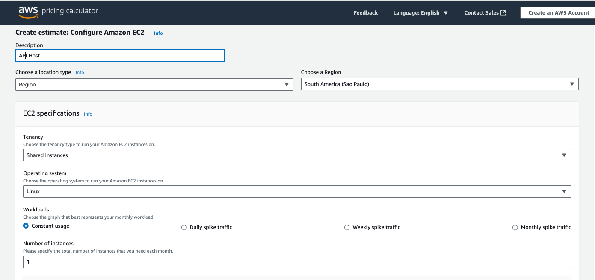
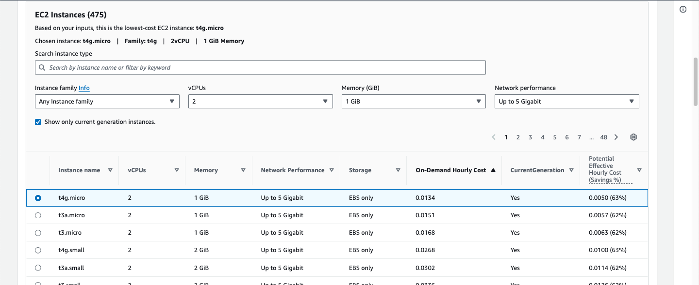
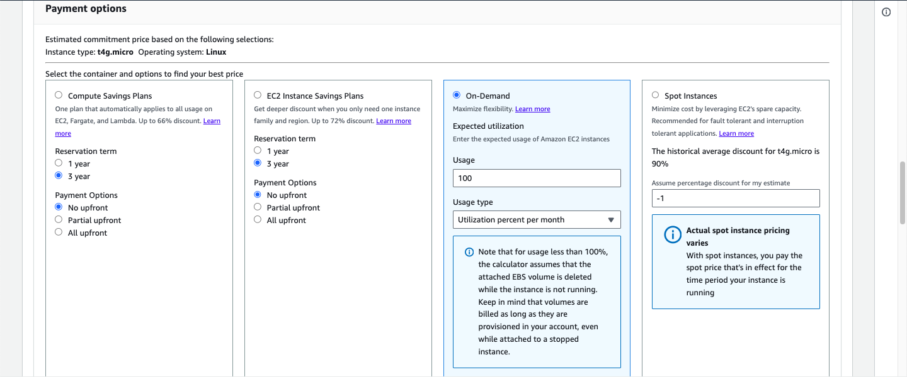
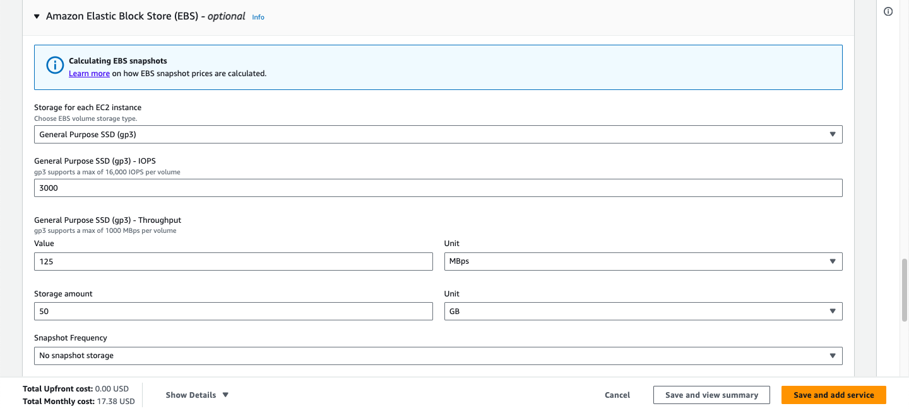
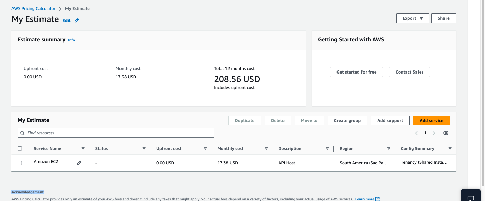
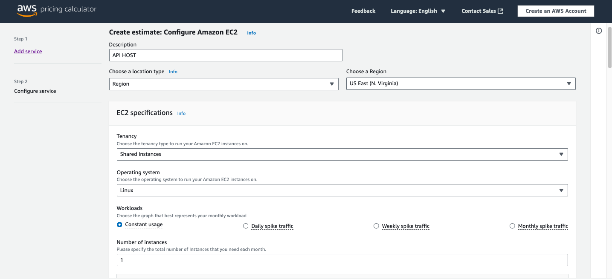
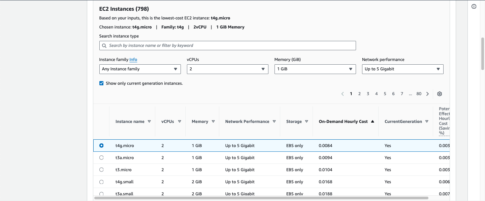
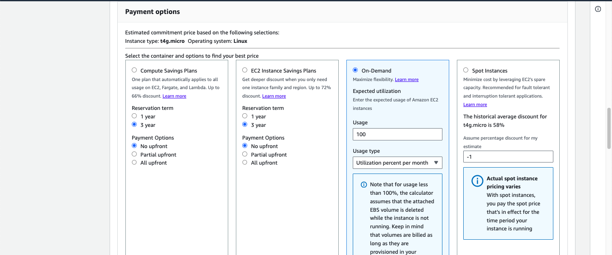
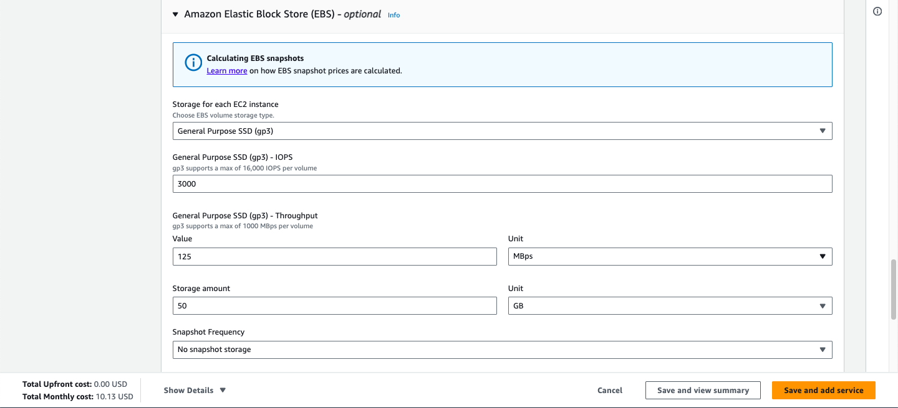
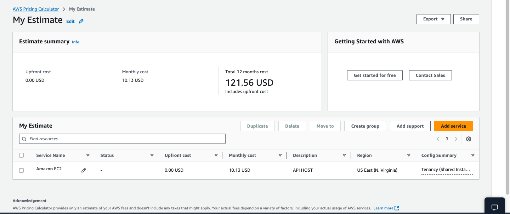

# activity-fiap-ai-p5a1

> Este projeto faz parte do curso de **Inteligência Artificial** da [FIAP](https://github.com/fiap) - Online 2024. Este repositório é a atividade "**Fase 5** - FarmTech Solutions: Machine Learning e Computação em Nuvem".

Este repositório abrange duas entregas obrigatórias da Fase 5. Na **Entrega 1**, implementamos modelos de aprendizado de máquina para prever o rendimento de safras em uma fazenda de 200 hectares, utilizando o dataset `crop_yield.csv`. Realizamos análise exploratória, clusterização para identificar tendências e desenvolvemos cinco modelos de regressão supervisionada, seguindo as boas práticas do CRISP-DM. Na **Entrega 2**, estimamos custos na AWS para hospedar uma API em uma máquina Linux simples, comparando as regiões de São Paulo (BR) e Virgínia do Norte (EUA), com justificativas baseadas em restrições legais e latência.

## Entrega 1 - Previsão de Rendimento de Safras

- **Vídeo Demonstrativo**: Exibição do modelo de Machine Learning - [https://youtube.com/watch?v=fakeMLDemo123](https://youtube.com/watch?v=fakeMLDemo123)  
- **Jupyter Notebook**: Documentação completa do processo - [Notebook](./LuisFillipeEmidio_rm559976_pbl_fase5.ipynb)  

Detalhamos a análise exploratória, clusterização e os modelos preditivos no notebook, com códigos comentados e conclusões.

## Entrega 2 - Estimativa de Custos na AWS

- **Vídeo Demonstrativo**: Comparação de custos entre regiões AWS - [Youtube](https://www.youtube.com/watch?v=Iy3-xdf4uU0)  

A estimativa considera uma máquina com 2 CPUs, 1 GiB de RAM, 5 Gbps de rede e 50 GB de armazenamento, com análise de viabilidade técnica e econômica.

### 📊 Comparação de Custos por Região AWS

| Região | Custo Mensal | Custo Anual |
|--------|-------------|-------------|
| **São Paulo (BR)** | **$17.38 USD** | **$208.56 USD** |
| **Virgínia do Norte (EUA)** | **$10.13 USD** | **$121.56 USD** |

### 📊 Gráfico Comparativo de Custos AWS

### 📷 Prints das Configurações AWS

📌 **Estimativa AWS - São Paulo**  

📌 **Estimativa AWS - Virgínia do Norte**  

### 📌 Justificativa da Escolha

Para determinar a melhor região para hospedar a API, consideramos três fatores principais:

✔ **Custo:** A AWS na Virgínia do Norte é **41.7% mais barata** do que São Paulo, o que representa uma economia significativa ao longo do tempo.

✔ **Latência:** Se a API precisar responder rapidamente para dispositivos e usuários no Brasil, a escolha de São Paulo pode ser mais vantajosa devido à menor latência. No entanto, para aplicações que não exigem resposta imediata, a diferença pode ser desprezível.

✔ **Restrições Legais:** Se houver **exigências regulatórias** para armazenar os dados no Brasil, a escolha da região de São Paulo pode ser obrigatória. Caso contrário, Virgínia do Norte continua sendo a melhor escolha pelo custo reduzido.

🔍 **Decisão Final:** Como nossa aplicação **não tem restrições legais** e prioriza **a economia de custos**, a melhor opção para hospedar a API é **AWS Virgínia do Norte**. Essa escolha proporciona **a maior redução de despesas** sem impactar a funcionalidade da solução.

## Equipe

### Membros

- Amandha Nery (RM560030)  
- Bruno Conterato (RM561048)  
- Gustavo Castro (RM560831)  
- Kild Fernandes (RM560615)  
- Luis Emidio (RM559976)  

### Professores

- **Tutor**: [Leonardo Ruiz Orabona](https://www.linkedin.com/in/leonardoorabona/)  
- **Coordenador**: [André Godoi](https://www.linkedin.com/in/profandregodoi/)  
